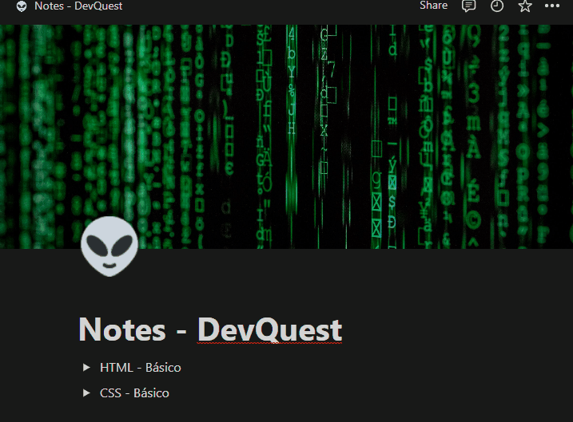

# Projeto com README
Um projeto de teste com um arquivo README 🖥

[]

## Tecnologias utilizadas
- HTML
- CSS
- JavaScript

# Como utilizar

1 - Clone o projeto
```
git clone <url>
```
2 - Acesse a pasta do projeto
```
cd repositorio-com-readme
```
